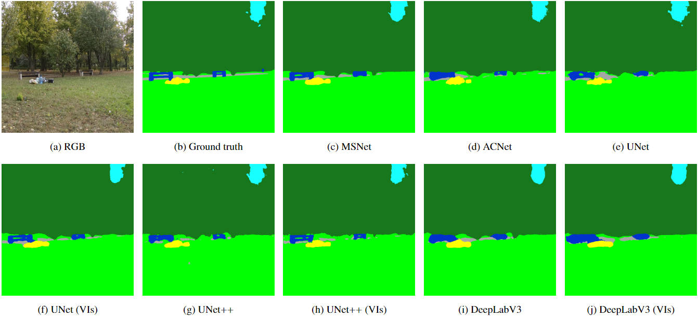

# Waste-recognition
Repository for training and testing different segmentation models on multispectral waste dataset.

The dataset and models' weights can be found at this [link](https://gofile.me/5waZC/m9EJIKIWh)


## Models

- [UNet](https://link.springer.com/chapter/10.1007/978-3-319-24574-4_28)
- [UNet++](https://www.researchgate.net/publication/327749044_UNet_A_Nested_U-Net_Architecture_for_Medical_Image_Segmentation_4th_International_Workshop_DLMIA_2018_and_8th_International_Workshop_ML-CDS_2018_Held_in_Conjunction_with_MICCAI_2018_Granada_Spain_Sept)
- [DeepLabV3](https://arxiv.org/abs/1706.05587)
- [DeepLabV3+](https://arxiv.org/abs/1802.02611)
- [ACNet](https://arxiv.org/abs/1905.10089)
- [MSNet](https://www.tandfonline.com/doi/full/10.1080/15481603.2022.2101728)

## Data structure

The images need to be in .npy format.

```md
root_dir/
├── data_folder/
│   ├── test/
│   │   ├── band1
│   │   ├── band2
│   │   ├── ...
│   │   └── band n
│   ├── train/
│   │   ├── band1
│   │   └── ...
│   └── val/
│       ├── band1
│       └── ...
└── results/
    └── result_folder_1/
        ├── model.pth
        └── parameters.csv

```

The structure of the .yaml file can be found under "data.yaml".

The "parameters.csv" file is created during training.

## Preprocessing
The preprocessing steps for the dataset (undistortion and registration) can be found at this [link](https://github.com/FilippoLucchelli/DJI_Image_Processing).

## Usage

### Visdom
Both "train.py" and "test.py" use [visdom](https://github.com/fossasia/visdom) for visualisation of the results. Starting a visdom server on another terminal is required for the scripts to work.

### Training

```console
python train.py --data_dir data.yaml --model msnet --save_folder result_folder 

```
For an overview of all the options use
```console
python train.py --help
```

### Test

```console
python test.py --data_dir data.yaml --model_dir result_folder
```
For an overview of all the options use
```console
python train.py --help
```
## Results



